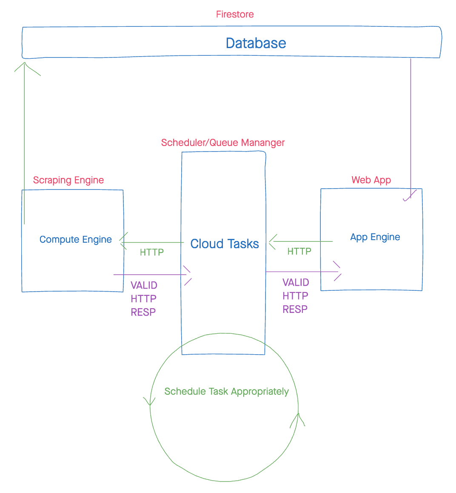
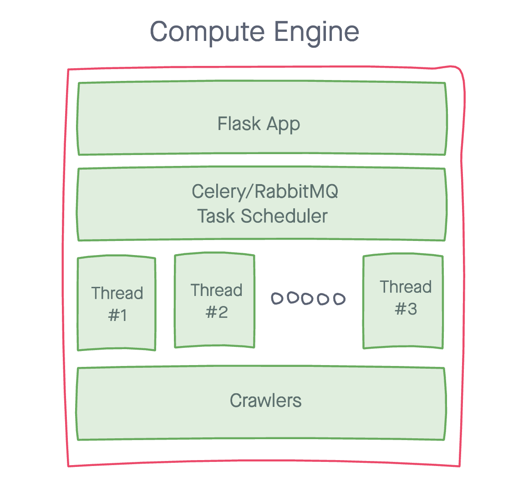

# TYS (WIP)

## Architechture

The app will hopefully be built using the architechture that's displayed below.
The reason for this is that this architechture should hopefully do very good at keeping things very seperated and modular. Meaning, when needed, we can always update each of the componenets of this architechture independently. This also allows us to use different technologies and languages on different levels of the components since everything is being done on the network side of things.

### Scraping Engine

The scraping engine is the most complicated part of the whole infrastructure. It's built entirely on Python and holds all the logic for the scraping and updating of the database. The front side of this is a flask application which deals with all the HTTP requests received to the application. The flask takes care of filtering these requests, authenticating, and translating the request so that the task scheduler can understand it.
Once the task scheduler receives a task then it deals entirely with deciding when this task should be executed and how important it is to get the results of this work. Each task then makes a call to the scrapers which do all the necessary work and return back the results that we need. The scheduling workflow can be found [here](link/to/some/part).

### Cloud Tasks

Cloud tasks here refers to google cloud tasks. This is the middleman between the compute engine and the app engine. In a general workflow:

1. the app engine makes a request to cloud tasks
2. cloud tasks receives the request to the queue and acknowledges it
3. cloud tasks sends the request to the compute engine
4. the compute engine acknowledges this request to google tasks
5. the compute engine prepares its own response as another HTTP request and sends it to the second queue
6. google tasks acks. this request and sends it back to the app engine
7. the app engine acks. the request and works on it.

The point of this rather lenghty workflow, is that we make sure that the compute engine only does the work it absoluetely has to do. This allows allows us to "intelligently" schedule the work for the compute engine while still allowing it to prepare for potential future tasks.

### App Engine

The app engine runs the web app. I haven't gotten around to completely architecht this module. so still incoming.